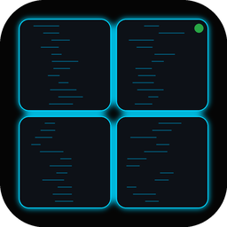

# agtmux-term

macOS terminal cockpit for managing AI agent sessions (Claude Code, Codex, etc.) running in tmux.



## Features

- **Sidebar** — live tmux session list grouped by session/window, agent status (Running / Waiting / Idle / Attention), conversation titles
- **Ghostty terminal** — GPU-accelerated rendering (~125fps via libghostty), native macOS IME, accurate VT parser
- **Real-time state** — agtmux daemon pushes agent state every second over Unix socket JSON-RPC
- **SSH targets** — connect to remote hosts (SSH/Mosh) and manage their sessions from one window
- **Claude hooks** — register/unregister/verify Claude Code hooks directly from the Settings sheet
- **Auto-launch** — creates a configured tmux session automatically when no local sessions are running
- **Daemon bundled** — XPC service manages the agtmux daemon lifecycle; zero manual setup

## Install

### Homebrew (recommended)

```bash
brew tap g960059/tap
brew install --cask agtmux-term
```

The daemon (`agtmux`) is bundled inside the app — no separate install needed.
Power users who want the CLI standalone:

```bash
brew install agtmux
```

### DMG

Download the latest `AgtmuxTerm-vx.y.z.dmg` from [Releases](https://github.com/g960059/agtmux-term/releases), open it, and drag `AgtmuxTerm.app` to Applications.

> **Note (v0.1.0):** This build is ad-hoc signed (not yet notarized). On first launch, right-click → Open, or run:
> ```bash
> xattr -dr com.apple.quarantine /Applications/AgtmuxTerm.app
> ```
> Future releases will be fully notarized once Apple Developer signing is set up.

## Requirements

- macOS 14 (Sonoma) or later
- tmux available in PATH (for local sessions)

## Build from Source

```bash
# 1. Clone with submodules (Ghostty source)
git clone --recursive https://github.com/g960059/agtmux-term
cd agtmux-term

# 2. Build GhosttyKit.xcframework
cd vendor/ghostty
zig build xcframework
cp -r zig-out/lib/GhosttyKit.xcframework ../../GhosttyKit/
cd ../..

# 3. Generate Xcode project
brew install xcodegen
xcodegen generate --spec project.yml

# 4. Build agtmux daemon (optional — app falls back to PATH)
cd ../agtmux && cargo build --release
export AGTMUX_BIN=$PWD/target/release/agtmux
cd ../agtmux-term

# 5. Open in Xcode or build via command line
open AgtmuxTerm.xcodeproj
# or: xcodebuild build -scheme AgtmuxTerm -destination "platform=macOS" AGTMUX_BIN=$AGTMUX_BIN
```

## Setup

### Claude Code Hooks

For live agent state updates, agtmux hooks into Claude Code's event system:

1. Open agtmux-term
2. Go to **Settings** (gear icon at sidebar bottom)
3. Click **Register** under "Claude Hooks"

Or from the CLI:

```bash
agtmux setup-hooks
```

### SSH Targets

Add remote hosts to monitor their tmux sessions over SSH/Mosh:

1. Settings → SSH Targets → Add Target
2. Enter hostname, username (optional), display name, and transport

### Auto-launch Session

Settings → Session → configure the session name to create on startup (default: `main`).
Set empty to disable.

## Daemon Resolution

The `agtmux` binary is resolved in this order:

1. `AGTMUX_BIN` env var (explicit override)
2. `AgtmuxTerm.app/Contents/Resources/Tools/agtmux` (bundled)
3. PATH and known directories (`~/.cargo/bin`, `/opt/homebrew/bin`, etc.)

## Architecture

```
agtmux-term (Swift macOS App)
├── GhosttyKit.xcframework    ← Built from Ghostty source via zig
├── CockpitView (SwiftUI)     ← Top-level layout: sidebar + workbench
├── SidebarView (SwiftUI)     ← Session list, filters, settings
├── WorkbenchAreaV2 (SwiftUI) ← Tab-based terminal workspace
└── Ghostty surface (Metal)   ← GPU terminal rendering
        │
        ├── AgtmuxDaemonService.xpc   ← XPC service managing daemon lifecycle
        ├── agtmux daemon (UDS RPC)   ← Agent state estimation engine
        └── tmux (PTY)                ← Terminal multiplexer
```

## Release / CI

| Workflow | Trigger | What it does |
|----------|---------|-------------|
| `ci.yml` | push / PR | Build + unit tests |
| `release.yml` | `v*` tag | Build universal binary → sign → notarize → DMG → GitHub Release → update Homebrew tap |

To release a new version:

```bash
git tag v0.2.0
git push origin v0.2.0
```

The workflow builds a universal (arm64 + x86_64) app with the `agtmux` daemon bundled, signs and notarizes it, creates a DMG, publishes a GitHub Release, and updates the Homebrew tap cask automatically.

Required GitHub secrets:

| Secret | Description |
|--------|-------------|
| `APPLE_DEVELOPER_CERTIFICATE_P12` | Base64-encoded Developer ID .p12 |
| `APPLE_DEVELOPER_CERTIFICATE_PASSWORD` | Password for the .p12 |
| `APPLE_TEAM_ID` | 10-character Apple Team ID |
| `APPLE_ID` | Apple ID email for notarytool |
| `APPLE_APP_SPECIFIC_PASSWORD` | App-specific password for notarytool |
| `HOMEBREW_TAP_TOKEN` | GitHub PAT with write access to `g960059/homebrew-tap` |

## Related

- **[agtmux](https://github.com/g960059/agtmux)** — Rust daemon that tracks AI agent state via Claude Code hooks, JSONL parsing, and tmux polling
- **[Ghostty](https://github.com/ghostty-org/ghostty)** — Terminal emulator providing libghostty (GPU rendering core)

## License

TBD
